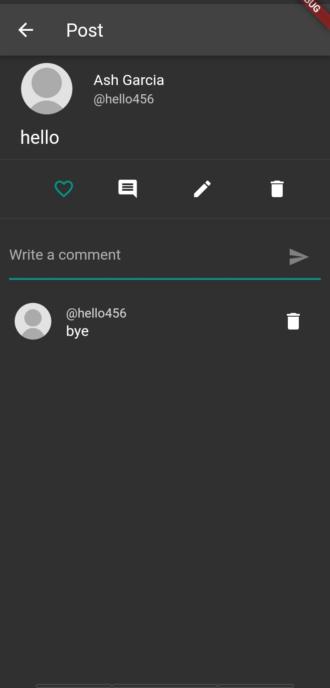
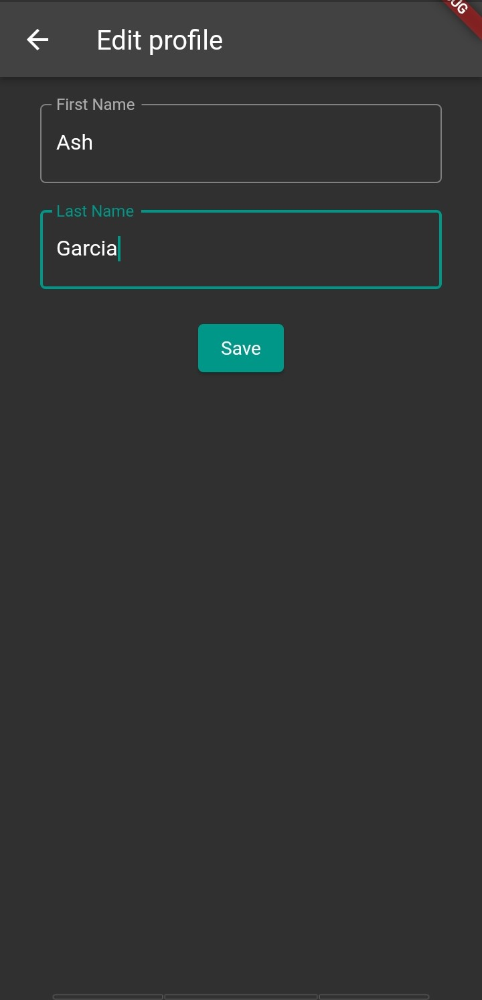

# Social Media App

A flutter social media application that uses the http package to retrieve, send, delete and update data over the internet. It has the following features:

- Register as new user
- Login
- Logout
- Update user profile
- Update user password
- View a list of public posts
- View a profile
- Follow another user
- View list users followed
- Unfollow a user
- Create a post (public or private)
- View a post
- Comment on a post
- Show all comments for a post
- Remove your own comment
- Show all of your or a friend’s posts
- Update a post
- Remove a post

## Documentation

### Screenshots of the app

> Upon starting the app
>   
> Creating new account
>   
> Logging in
>   
> Home screen / Public posts
>   
> Next page of posts
>   
> Viewing profile
>   
> Friends list
>   
> Creating new post
>   
> Viewing post
>   
> Adding comment
>   
> Viewing user profile
>   
> Updating profile
>   
> Menu
>   
> Updating password
> 

### Test Cases

Test Case 1

- Description: Registering as new user
- Test Steps:
  1. Tap "Create new account".
  2. Fill out text fields.
  3. Tap "Sign up".
- Expected result:
  - Snackbar saying "Creating account" should appear after tapping "Sign up" button. If data is sent to sever and new user is successfully created, "Successfuly created account. Please sign in." should appear.
- Actual result:
  - Snackbar saying "Creating account" is shown and text fields are cleared after tapping "Sign up" button. "Successfuly created account. Please sign in." is also shown.

Test Case 2

- Description: Registering as new user while text field/s is/are blank
- Test Steps:
  1. Tap "Create new account".
  2. Tap "Sign up".
- Expected result:
  - Error message appears for the text fields that are blank and account creation should not proceed.
- Actual result:
  - Error messages are shown for the text fields that are blank when the sign up button is tapped.

Test Case 3

- Description: Registering as new user but user is already existing
- Test Steps:
  1. Tap "Create new account".
  2. Fill out text fields.
  3. Tap "Sign up".
- Expected result:
  - Snackbar saying "Account already existing" should appear and after tapping "Sign up" button. New user will not be created.
- Actual result:
  - Snackbar saying "Creating account" is shown and text fields are cleared after tapping "Sign up" button but "Successfuly created account. Please sign in." is does not appear.

Test Case 4

- Description: Logging in
- Test Steps:
  1. Enter username and password.
  2. Tap "Log in".
- Expected result:
  - User is logged in and the home screen is shown.
- Actual result:
  - Snackbar saying "Logging in" is shown and text fields are cleared after tapping "Log in" button. "Logged in" appears and user is also brought to the homescreen if login is successful.

Test Case 5

- Description: Logging in but username is incorrect or user does not exist
- Test Steps:
  1. Enter incorrect username.
  2. Enter password.
  3. Tap "Log in".
- Expected result:
  - User should not be logged in and prompt saying "User does not exist" should appear.
- Actual result:
  - Snackbar saying "Logging in" is shown and text fields are cleared after tapping "Log in" button. Data will be sent to the server but "user doesn't exist" is shown in the snackbar.

Test Case 6

- Description: Logging in but password is incorrect
- Test Steps:
  1. Enter username.
  2. Enter incorrect password.
  3. Tap "Log in".
- Expected result:
  - User should not be logged in and prompt saying "Password is incorrect" should appear.
- Actual result:
  - Snackbar saying "Logging in" is shown and text fields are cleared after tapping "Log in" button. Data will be sent to the server but "password is incorrect" is shown in the snackbar.

Test Case 7

- Description: Logging out
- Test Steps:
  1. Tap menu icon in bottom navigation bar.
  2. Tap "Log out".
- Expected result:
  - User should be logged out and should return to log in screen.
- Actual result:
  - Snackbar saying "Logging out" is shown after tapping "Log out" button and user is returned to the log in screen.

Test Case 8

- Description: Updating user profile
- Test Steps:
  1. Tap profile icon in bottom navigation bar.
  2. Tap "Edit Profile".
  3. Fill out with new details.
  4. Tap "Save".
- Expected result:
  - User profile should be updated and changes should be reflected in the profile.
- Actual result:
  - Snackbar saying "Saving changes" is shown after tapping "Save" button. User is then returned to the profile screen and "Changes saved" is shown in snackbar.

Test Case 9

- Description: Updating password
- Test Steps:
  1. Tap menu icon in bottom navigation bar.
  2. Tap "Update password".
  3. Enter current password and new password.
  4. Tap "Update password".
- Expected result:
  - Password should be updated and new password should be functional the next time the user logs in.
- Actual result:
  - Snackbar saying "Updating password" is shown after tapping "Update password" button. User is then returned to the menu screen and "Password updated" is shown in snackbar. New password is functional if user logs in again.

Test Case 10

- Description: Updating password but current password entered is incorrect
- Test Steps:
  1. Tap menu icon in bottom navigation bar.
  2. Tap "Update password".
  3. Enter incorrect current password and new password.
  4. Tap "Update password".
- Expected result:
  - Password should not be updated and new password should not be functional the next time the user logs in.
- Actual result:
  - Snackbar saying "Updating password" is shown after tapping "Update password" button. User stays in the update password screen and "old password is incorrect" is shown in snackbar. New password is not functional if user logs in again.

Test Case 11

- Description: Viewing a list of public posts
- Test Steps:
  1. Tap home icon in bottom navigation bar.
  2. Tap left or right button to go to previous/next page.
- Expected result:
  - A list of public posts should appear on the screen. A new set of posts should be shown if the left/right button is tapped.
- Actual result:
  - A list of public posts appears on the screen if home button is tapped. A new set of posts should is shown if the right button is tapped. User is brought back to posts in first page if left button is tapped. Error occurs if left button is tapped while in the first page.

Test Case 12

- Description: Viewing user profile
- Test Steps:
  1. Tap profile icon in bottom navigation bar.
- Expected result:
  - User details which includes username, first name, last name, number of posts, and number of friends/following should be shown.
- Actual result:
  - The profile of the user which includes username, first name, last name, number of posts, and number of friends/following is shown.

Test Case 13

- Description: Viewing another user's profile
- Test Steps:
  1. Tap avatar of another user.
- Expected result:
  - The profile and posts of the selected user, and a follow button should be shown.
- Actual result:
  - The profile and posts of the selected user, and a follow/following button are shown. User can also see the selected user's private posts if the user is following them.

Test Case 14

- Description: Following another user
- Test Steps:
  1. Tap avatar of another user.
  2. Tap "Follow" button.
- Expected result:
  - "Follow" button should change to "Following". Followed user should be added to the current user's friends. The followed user's private posts should be visible.
- Actual result:
  - "Follow" button changes to "Following". Followed user is added to the current user's friends. The followed user's private posts will be visible. Number of friends is also updated.

Test Case 15

- Description: Showing list of all users followed
- Test Steps:
  1. Tap friends icon.
- Expected result:
  - All other users followed by the current user should be shown.
- Actual result:
  - User is brought to the friends screen where all users followed is shown.

Test Case 16

- Description: Unfollowing a user
- Test Steps:
  1. Tap friends icon or avatar of user to be unfollowed.
  2. Tap "Following" button.
- Expected result:
  - Unfollowed user should be removed from the following list of the current user. "Following" button should change to "Follow". Private posts should be hidden.
- Actual result:
  - Unfollowed user is removed from the following list in the friends screen. Number of friends is updated. "Following" button is changed to "Follow". Private posts are hidden.

Test Case 17

- Description: Creating a public post
- Test Steps:
  1. Tap add icon.
  2. Enter content of post.
  3. Tap "Post" button.
- Expected result:
  - Public post should be created and appear on the home screen and the user's profile.
- Actual result:
  - Snackbar saying "Sending post" is shown after tapping "Post". Once post is sent, "Post sent" is shown in snackbar and text field is cleared. Post appears on the user's profile and the home screen.

Test Case 18

- Description: Creating a private post
- Test Steps:
  1. Tap add icon.
  2. Enter content of post.
  3. Check "Private" checkbox.
  4. Tap "Post" button.
- Expected result:
  - Private post should be created and appear on the the user's profile only.
- Actual result:
  - Snackbar saying "Sending post" is shown after tapping "Post". Once post is sent, "Post sent" is shown in snackbar and text field is cleared. Post appears on the user's profile only.

Test Case 19

- Description: Viewing a post
- Test Steps:
  1. Tap post.
- Expected result:
  - Details of the user who posted, content of the post, reaction bar, and comment field should be shown.
- Actual result:
  - Details of the user who posted, content of the post, reaction bar, and comment field are shown.

Test Case 20

- Description: Commenting on a post
- Test Steps:
  1. Tap a post or comment icon.
  2. Tap comment field.
  3. Enter comment.
  4. Tap send icon.
- Expected result:
  - Comment should be created and appear on the comment section of the post.
- Actual result:
  - Snackbar saying "Posting comment" is shown after tapping send icon. Once comment is sent, "Comment posted" is shown in snackbar. Comment text field is cleared and comment appears on the comment section below the post.

Test Case 21

- Description: Show comments on a post
- Test Steps:
  1. Tap a post or comment icon.
  2. Scroll down (if possible).
- Expected result:
  - List of comments should appear below the post.
- Actual result:
  - List of comments along with the username of who commented is shown below the post.

Test Case 22

- Description: Delete a comment on a post
- Test Steps:
  1. Tap a post or comment icon.
  2. Tap delete icon corresponding to the comment to be deleted.
- Expected result:
  - Comment should be removed from the list of comments.
- Actual result:
  - Comment disappears and is removed from the list of comments.

Test Case 23

- Description: Updating a post
- Test Steps:
  1. Tap user's post.
  2. Tap edit icon.
  3. Edit content or privacy of post.
  4. Tap "Save".
- Expected result:
  - Post should be updated and changes should be reflected in the home screen user profile, and when post is viewed.
- Actual result:
  - Snackbar saying "Saving changes" is shown after tapping "Save" button. User is then brought to the home screen and "Changes saved" is shown in snackbar. Content or privacy of the post is updated.

Test Case 24

- Description: Deleting a post
- Test Steps:
  1. Tap user's post.
  2. Tap delete icon.
- Expected result:
  - Post should be removed from the home screen and user's profile.
- Actual result:
  - Snackbar saying "Deleting post" is shown after tapping delete button. Once successfully deleted, "Post deleted" is shown in snackbar and post is removed in the home screen and user's profile.
